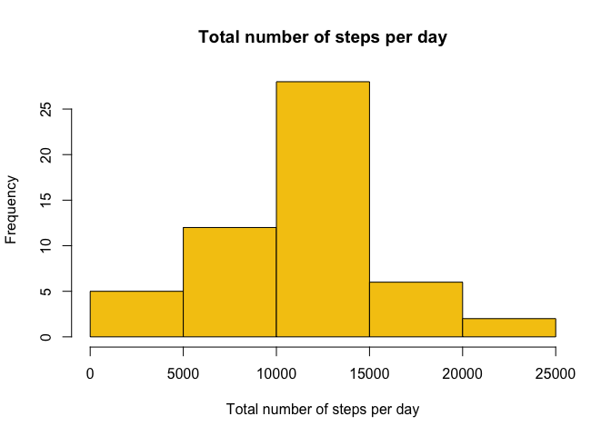
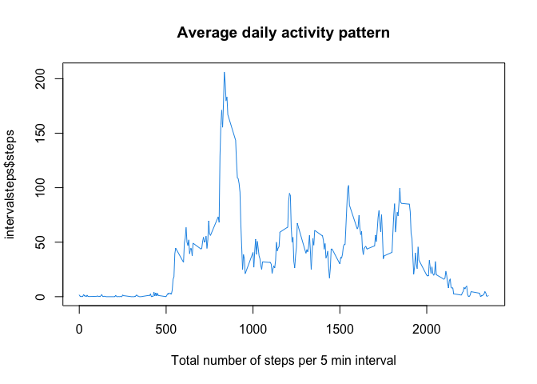
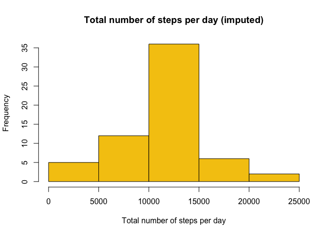
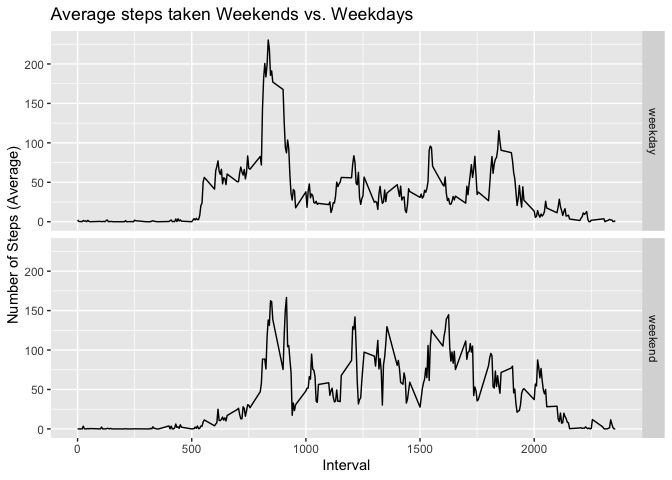

## Loading and preprocessing the data


```r
mydata <- read.csv("activity.csv")
newdata <- na.omit(mydata)
newdata$date <- as.Date(newdata$date)
```

## What is mean total number of steps taken per day?


```r
library(dplyr)
```

```
## 
## Attaching package: 'dplyr'
```

```
## The following objects are masked from 'package:stats':
## 
##     filter, lag
```

```
## The following objects are masked from 'package:base':
## 
##     intersect, setdiff, setequal, union
```

```r
# grouping by date
stepstotal <- mydata %>% 
        group_by(date) %>% 
        summarize(sumOfSteps = sum(steps))

# plotting a histogram
hist(stepstotal$sumOfSteps, col = 7, main="Total number of steps per day", 
     xlab = "Total number of steps per day")
```

<!-- -->

```r
meansteps <- mean(mydata$steps, na.rm = TRUE)
mediansteps <- median(meansteps, na.rm = TRUE)
```
The mean total number of steps per day is 37.3825996 and the median is 37.3825996.

## What is the average daily activity pattern?


```r
# grouping by intervals
intervalsteps <- aggregate(steps ~ interval, newdata, mean)
# making a plot
plot(intervalsteps$interval, intervalsteps$steps, type="l", col = 4, 
     main="Average daily activity pattern", 
     xlab = "Total number of steps per 5 min interval")
```

<!-- -->

```r
max_row_id <- which.max(intervalsteps$steps)
intervalsteps [max_row_id, ]
```

```
##     interval    steps
## 104      835 206.1698
```
The interval 104 has the maximum average number of steps 835, 206.1698113.

## Imputing missing values


```r
NAvars <- sum(is.na(mydata$steps))
```
There are 2304 missing values.

```r
myFillData <- mydata
for (i in 1:nrow(myFillData)) {
        if (is.na(myFillData$steps[i])) {
                interval_value <- myFillData$interval[i]
                steps_value <- intervalsteps[
                        intervalsteps$interval == interval_value,]
                myFillData$steps[i] <- steps_value$steps
        }
}
myFillData$date <- as.Date(myFillData$date)

fill_agg <- aggregate(steps ~ date, myFillData, sum)
hist(fill_agg$steps, col = 7, main="Total number of steps per day (imputed)", 
     xlab = "Total number of steps per day")
```

<!-- -->

## Are there differences in activity patterns between weekdays and weekends?

```r
myFillData$day <- weekdays(myFillData$date)
myFillData$daytype <- "weekday"
myFillData$daytype[myFillData$day %in% c("Saturday", "Sunday")] <- "weekend"
avgDay <- myFillData %>%
        group_by(daytype, interval) %>%
        summarize(avgSteps = mean(steps))

library(ggplot2)
qplot(interval, avgSteps, data = avgDay, type="l", geom="line",
      xlab="Interval", ylab="Number of Steps (Average)",
      main="Average steps taken Weekends vs. Weekdays",
      facets = daytype ~ .)
```

```
## Warning: Ignoring unknown parameters: type
```

<!-- -->
